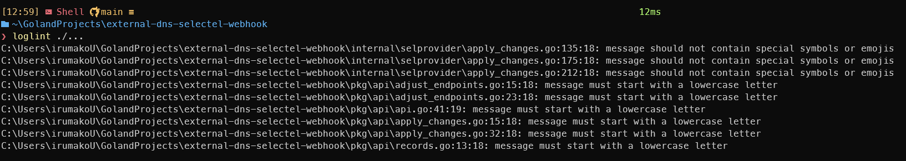

# loglint

## Линтер для проверки лог-записей.

### Тестовое задание по направлению «Backend-разработка. Golang»

Линтер проверяет фиксированный набор правил:

- сообщение должно начинаться со строчной буквы
- сообщение должно быть на английском языке
- сообщение не должно содержать спецсимволы и эмодзи
- сообщение не должно содержать потенциально чувствительные данные

## Поддерживаемые логгеры

Сейчас `loglint` анализирует вызовы для:

- `log/slog`
- `*slog.Logger`
- `*zap.Logger`
- `*zap.SugaredLogger`

Поддерживаемые методы определены в анализаторе и покрывают основные точки логирования этих логгеров.

## Установка и использование

### Вариант 1. Через `go install`

Установка бинаря:

```bash
go install github.com/irumako/loglint/cmd/loglint@<version>
```

Запуск в целевом Go-проекте:

```bash
loglint ./...
```

`loglint` собирается как standalone `singlechecker` binary поверх `go/analysis`, поэтому его можно запускать напрямую по
Go-пакетам без дополнительных оберток.

### Вариант 2. Модульный плагин для `golangci-lint`

Инструкция по подключению через `golangci-lint custom` находится в [docs/golangci-lint.md](docs/golangci-lint.md).
Пример build-конфига также есть в [`./.custom-gcl.yml`](./.custom-gcl.yml).

## Конфигурационный файл

`loglint` поддерживает конфигурационный файл `.loglint.yml` в текущей рабочей директории. Если файл найден, линтер читает его перед запуском анализа. Если файла нет, используются настройки по умолчанию.

Пример:

```yaml
disabledRules:
  - english-only
  - special-symbols
```

Сейчас доступна одна настройка:

- `disabledRules` - список идентификаторов правил, которые нужно отключить

Поддерживаемые идентификаторы правил:

- `lowercase-first-letter`
- `english-only`
- `special-symbols`
- `sensitive-data`

## Пример

```go
package main

import "log/slog"

func main() {
	slog.Info("User created")
	slog.Info("password check failed")
}
```

Ожидаемые диагностики:

```text
message must start with a lowercase letter
message may contain potentially sensitive data
```

## Проверка на реальном проекте

`loglint` был проверен на реальном проекте [
`selectel/external-dns-selectel-webhook`](https://github.com/selectel/external-dns-selectel-webhook).

Команда запуска:

```bash
loglint ./...
```

Результат:



Во время этого прогона линтер нашел реальные проблемы, включая:

- сообщения, начинающиеся с заглавной буквы
- сообщения со спецсимволами или emoji

## Вопросы и проблемы

Этот раздел предназначен как журнал вопросов и проблем, которые возникали по ходу разработки, и способов их решения.

| Вопрос или проблема                                                                                  | Решение                                                                                                                                                       |
|------------------------------------------------------------------------------------------------------|---------------------------------------------------------------------------------------------------------------------------------------------------------------|
| _Нужно ли анализировать только строковые литералы (*ast.BasicLit) или также динамические выражения?_ | _Проверяем только строковые литералы, для 4 правила запрещаем все кроме строковых литералов, так как есть потенциально может содержать чувствительные данные_ |
| _Что делать с параметризованными логами?_                                                            | _Проверям только сообщение_                                                                                                                                   |
| _Как `loglint` читает конфигурационный файл?_                                                        | _Линтер ищет `.loglint.yml` только в текущей рабочей директории, читает его как YAML и применяет настройки перед анализом_                                  |
| _Какие настройки доступны в конфиге?_                                                                | _Сейчас поддерживается `disabledRules` - список идентификаторов правил, которые нужно отключить_                                                             |

## Использование ИИ

ИИ использовался как вспомогательный инструмент, а итоговые результаты дополнительно проверялись и дорабатывались
вручную.

ИИ использовался для:

- помощи в генерации unit-тестов
- помощи в подготовке тестовых файлов
- помощи в подборе ключевых слов для поиска чувствительных данных
